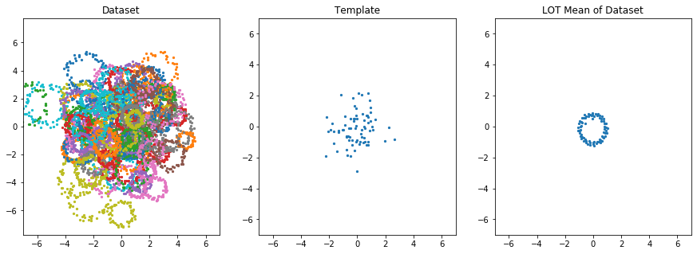
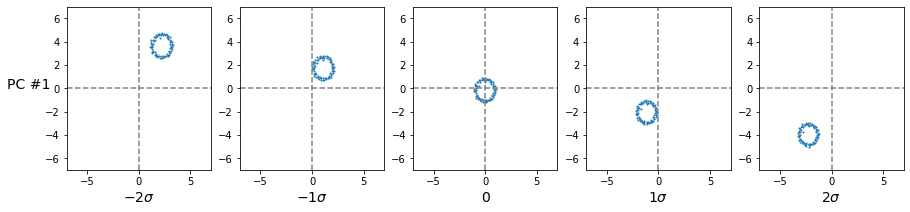
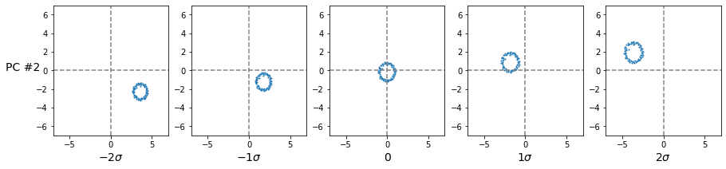
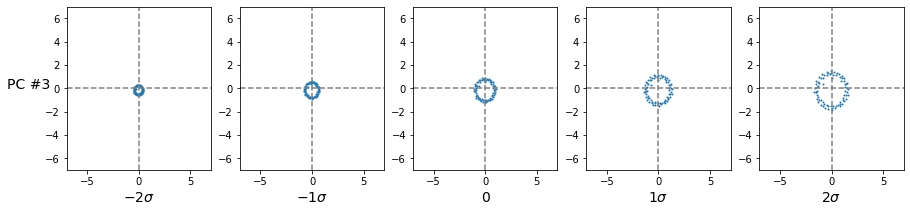

# Linear Optimal Transport (LOT)
This repo gives a simple tutorial of the Linear Optimal Transport (LOT) framework presented in the following papers: 

* [Wang, Wei, et al. "A linear optimal transportation framework for quantifying and visualizing variations in sets of images." *International journal of computer vision* 101.2 (2013): 254-269.](https://link.springer.com/article/10.1007/s11263-012-0566-z)
* [Kolouri, Soheil, et al. "A continuous linear optimal transport approach for pattern analysis in image datasets." *Pattern recognition* 51 (2016): 453-462.](https://www.sciencedirect.com/science/article/abs/pii/S0031320315003507)
* [Kolouri, Soheil, et al. "Optimal mass transport: Signal processing and machine-learning applications." *IEEE signal processing magazine* 34.4 (2017): 43-59. ](https://ieeexplore.ieee.org/document/7974883)

## Requirements:

* [POT](https://pythonot.github.io/) : A truly wonderful library for Optimal Transport developed by Flamary et al.  
* [Sklearn](https://scikit-learn.org/stable/)
* [Matplotlib](https://matplotlib.org/)

  ## What can it do?

Lets assume that we have empirical samples from a set of distributions, and that we have different number of samples from each distribution, as shown in the following figure: 

LOT provides a nonlinear transformation to the LOT space (i.e., transport space) in which we can use linear methods to learn the statistical characteristics of these distributions. For instance, calculating the mean of the distributions in the LOT space leads to:

Or you can calculate the principle variations of the distributions via PCA in the LOT space, which leads to: 

These are but a few examples showing what one can do with the LOT transform. 